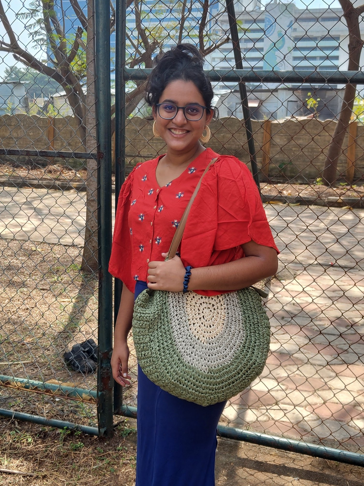

Hi :) This is Anusha! (you can also check out [[my quirkier non professional introduction]] or my [[Academic Profile]])
# my interests 

I am interested in Theoretical Computer Science, and am currently exploring and reading about #logic, [[Finite Model Theory]] and Complexity Theory.

Last year, I enjoyed knowing about Classical Logic, [[Modal Logic]], [[What do intuitionists think?|intuitionistic Logic]], [[Games On Graphs]] and [[Proofs and Types]].

I like how "clean" thinking in logic is, and how it makes me look at things in a philosophical manner.  I think I might end up joining the Category Theory cult.
# about myself 

I am a third year student at [Chennai Mathematical Institute](https://www.cmi.ac.in/), and I am doing Bachelors in Mathematics and Theoretical Computer Science.

Before my university, I was [[lost]] and then found by [Informatics Olympiad](https://en.wikipedia.org/wiki/International_Olympiad_in_Informatics?useskin=vector), which became my home and niche for roughly a year and a half. During this time, I also got a chance to be in India's team for [[European Girls Olympiad In Informatics (EGOI)]] in 2023, and grabbed a bronze.
## contact
drop an email to : anusha.ug2023@cmi.ac.in 
# about this garden
> [!quote] why this garden?
> _"A throw of seeds."_
> 
> _Some grow into beautiful bushes with flowers, yielding fruit that others can enjoy, whilst some are left unnurtured._
## but what is a digital garden?
Digital Gardens are personal websites or blogs where people share their own ideas and knowledge with the world. It's a way for people to express themselves, work on their writing skills, and discuss topics that interest them, iterating articles and pages as their knowledge grows. They are free-flowing work-in-progress wikis for others to explore. 
As a consequence, there will be some` flowers and beautiful trees` which represents that the seeds were watered and taken care of properly, or in other words, the seed of *interest in a particular topic* was fed and nourished properly. Whereas, some seeds become dormant if, it was inspired at some point of time, but it did not receive enough attention and effort that was required. 